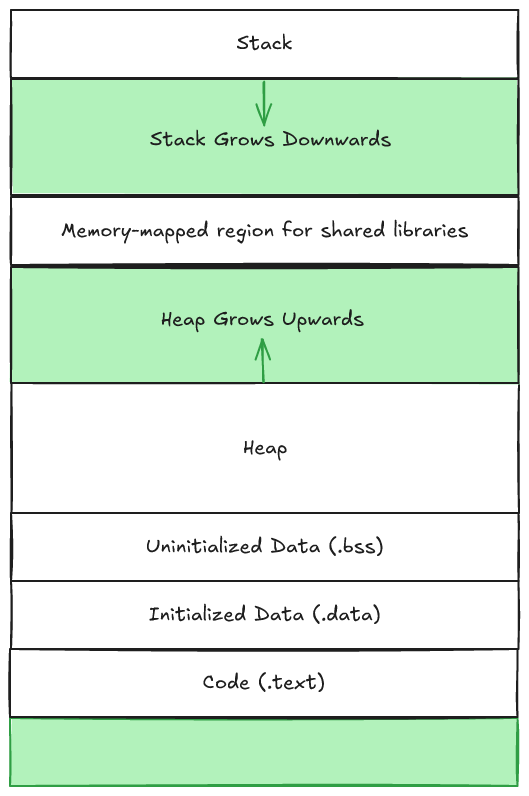

# The Heap

The heap can be understood as a section in a computers memory that has a bunch of blocks, each block is a chunk of virtual memory that is either allocated or free. 

Here's a simple diagram to illustrate the concept: 



To elaborate a bit here, the Unintialized Data section is utilized for global static variables such as

```c
int global_count;
static float buffer[1024]; //Uninitialized array
```

Whereas initialized data is utilized to hold initialized global static variables

```c
int global_cound = 42;
static char name[] = 'Ian'; //Initialized character array
```

Code or .text is where you would find the compiled program instructions. 

These .bss, .data, and .text sections will show up in the assembly code, but we'll not cover that in this writeup. 

## Explicit Vs. Implicit Allocators

The Heap is usually accessed through something like an explicit or implicit allocator.

These will handle allocating, freeing and reallocating memory.

**Explicit Allocators** - are memory allocators that you have to call yourself and in the C standard library these are functions like malloc and free, whereas in C++ you'll find them as new and delete.

**Implicit Allocators** - handle memory automatically they detect when a program is no longer using a memory block and they free that memory block. These implicit allocators are also known as Garbage Collectors. Higher level languages usually have some form of garbage collector . Languages like Java, Python, JavaScript, Go, Ruby and C# all have garbage collectors.


## Malloc

```C
#include <stdlib.h>
void *malloc(size_t size);
```

In the C standard library there is a malloc function that allocates memory and returns a pointer to that block of memory if successful and `null` if unsuccessful

Note: errno is also set if malloc returns null, read more on [errno](./errno.md)

malloc doesn't initialize the memory it allocates. 

## Calloc 

Calloc can be called to both allocate memory and initialize that memory to 0, it's a wrapper for malloc.

## Free

A program can free allocated heap memory by calling the free function

```C

#include <stdlib.h>

void free(void *ptr)

```

See if you can spot a potential issue with the free function...

**Important** free is a void return therefore it will not give you an error. This can cause an issue because if you don't input the correct pointer to the free function you can get some crazy runtime errors.


